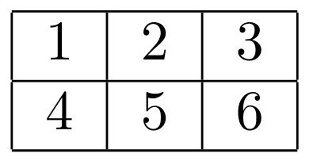
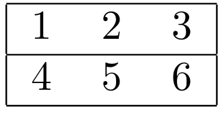
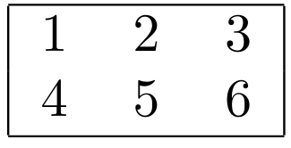
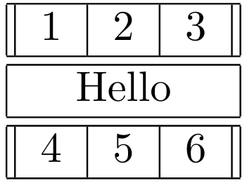

# Tabellen in LaTeX 

Um Tabellen in LaTeX zu erstellen, kann man beispielsweise die Umgebung `tabular` benutzen. 

LaTeX gibt uns sehr viel Freiraum bei der Erstellung von Tabellen, was auch heißt, dass wir jede scheinbare Kleinigkeit, die z.B. bei Word offensichtlich ist (wie dass Zellen durch Striche von anderen Zellen abgetrennt sind) explizit angeben müssen. Das kann am Anfang nervig scheinen, ist aber eine gute Sache, wenn wir z.B. komplexere Tabellen genau nach unseren Wünschen gestalten wollen.

## Beispiel

Schauen wir uns eine einfache 2x3 Tabelle an: 


Diese Tabelle wird durch den folgenden Code beschrieben: 

```
\begin{tabular}{ |c|c|c| } 
    \hline
    1 & 2 & 3 \\ 
    \hline
    4 & 5 & 6 \\ 
    \hline
\end{tabular}
```

## Aufgabe

Eure Aufgabe besteht darin, anhand des Beispiels in Overleaf LaTeX Tabellen zu erstellen, die möglichst genauso aussehen, wie es die folgenden Fotos jeweils darstellen. 

Hinweis: Alle Abbildungen sind jeweils *eine* Tabelle.

### Tabelle 1



### Tabelle 2



### Tabelle 3



### Tabelle 4 (Pro)

yet to come
